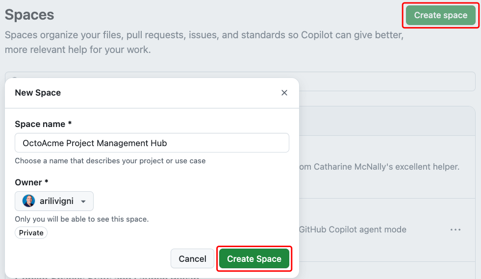
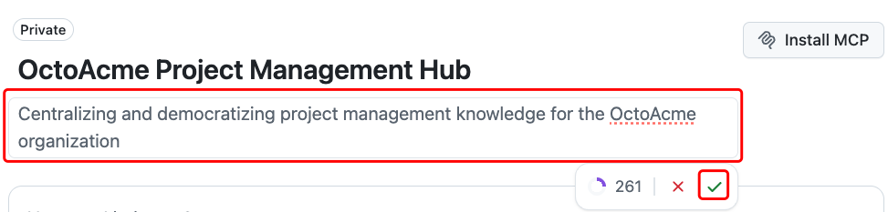
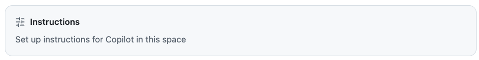
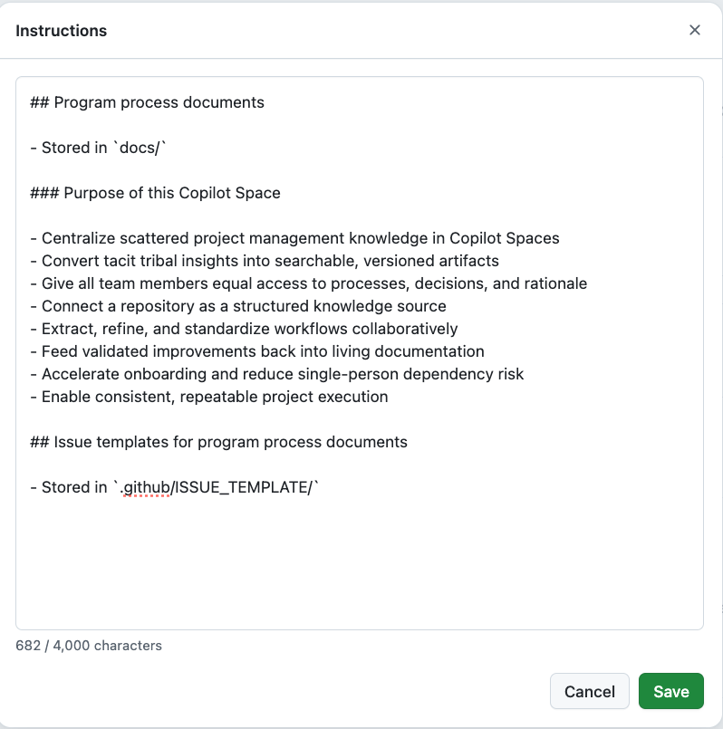
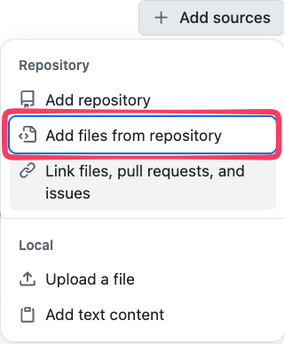
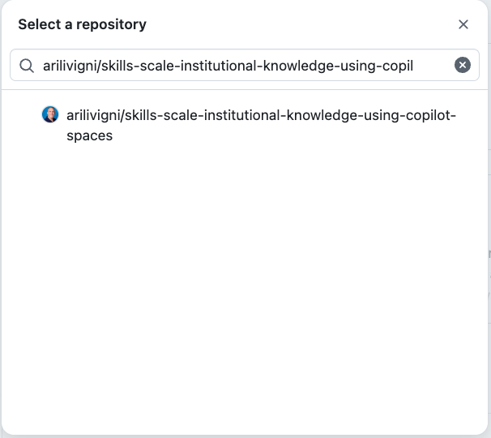
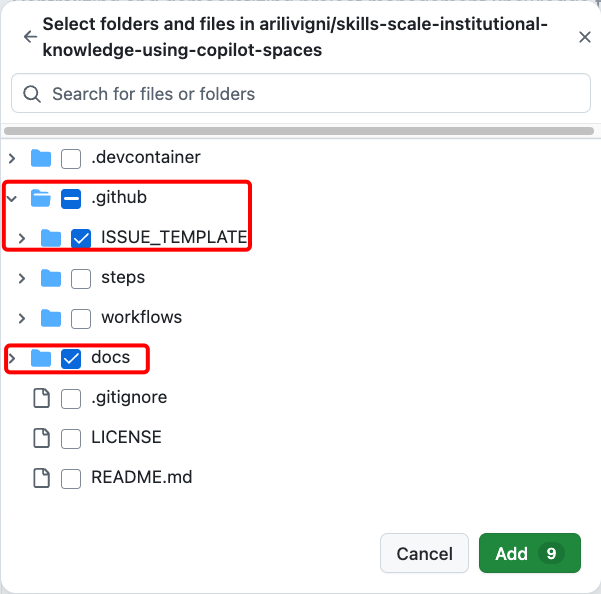
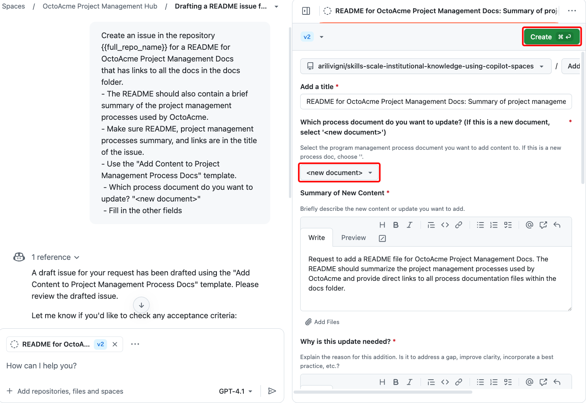
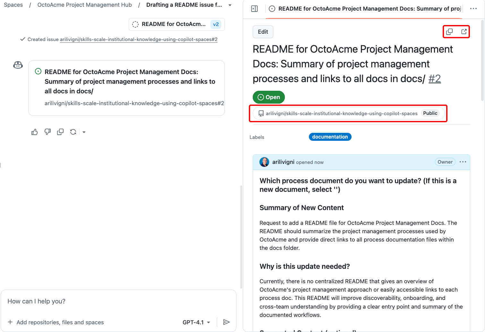

## Step 1: Create and prime your Copilot Space

In this step you will establish a Copilot Space and give it the minimum context it needs to act as a project management knowledge hub for OctoAcme.

### How does using Spaces affect my usage?

Questions you submit in a space count as Copilot Chat requests.

- If you're a Copilot Free user, this usage counts toward your monthly chat limit.
- If you use Spaces with a premium model, this usage counts toward your premium usage quota. Every question you submit to a premium model counts as one premium request, multiplied by the model's multiplier. For information about the multipliers applied to each model, see [Requests in GitHub Copilot](https://docs.github.com/en/copilot/managing-copilot/understanding-and-managing-copilot-usage/understanding-and-managing-requests-in-copilot#model-multipliers).

- [Use Copilot Spaces](https://docs.github.com/en/copilot/how-tos/provide-context/use-copilot-spaces/)

### 📖 Theory: Using Copilot Spaces as a Knowledge Hub

GitHub Copilot Spaces enables teams to centralize and democratize organizational knowledge by providing a collaborative environment for storing, searching, and refining process documentation. By connecting your repository as a source, Copilot Spaces can index your documentation and issue templates, making them easily accessible and actionable for all team members. This approach reduces single-person dependency risk, accelerates onboarding, and ensures that project management processes are consistent and repeatable.

To get started, you need access to Copilot Spaces and a GitHub Copilot plan with premium request units. Each prompt in a Space counts toward your usage quota, so be mindful of your plan's limits. For more details, see [GitHub Copilot plans](https://docs.github.com/en/copilot/get-started/plans#comparing-copilot-plans) and [Copilot Requests](https://docs.github.com/en/copilot/concepts/billing/copilot-requests).

> [!IMPORTANT]
> If you are using a Copilot free plan or are concerned with impacting premium usage quotas, use a **0x** model or **Auto** if available. These models do not consume premium request units. For more information, see [GitHub Copilot plans](https://docs.github.com/en/copilot/get-started/plans#comparing-copilot-plans) and [Copilot Requests](https://docs.github.com/en/copilot/concepts/billing/copilot-requests).

### ⌨️ Activity: Create your OctoAcme Project Management Hub Copilot Space

1. Navigate to GitHub Copilot Spaces https://github.com/copilot/spaces (ensure you have access to this feature)
1. Click **Create Space** button
1. Name your Space:

   > ```text
   > OctoAcme Project Management Hub
   > ```

1. Click **Create Space**

   

   Add a description:

      > ```text
      > Centralizing and democratizing project management knowledge
      > for the OctoAcme organization
      > ```

      

### ⌨️ Activity: Add instructions to your Copilot Space

1. In your newly created Copilot Space, look for the **Instructions** box and click in the **Instructions** box

   

1. Add the following instructions to provide context about the repository and its purpose

   > ```markdown
   > ## Program process documents
   >
   > - Stored in `docs/`
   >
   > ### Purpose of this Copilot Space
   >
   > - Centralize scattered project management knowledge in Copilot Spaces
   > - Convert tacit team insights into searchable, versioned artifacts
   > - Give all team members equal access to processes, decisions, and rationale
   > - Connect a repository as a structured knowledge source
   > - Extract, refine, and standardize workflows collaboratively
   > - Feed validated improvements back into living documentation
   > - Accelerate onboarding and reduce single-person dependency risk
   > - Enable consistent, repeatable project execution
   >
   > ## Issue templates for program process documents
   >
   > - Stored in `.github/ISSUE_TEMPLATE/`
   > ```

   It should look something like this when you're done:

   

1. Click **Save**

### ⌨️ Activity: Add your cloned repository as a source repository to your Copilot Space

1. In your newly created Copilot Space, look for the  button
1. Click **Add files from repository**
   - Copy and paste your GitHub repository for this exercise called out below.
   - You can also type the name in the search and it will come up as well or copy/paste the name below.

     > ```text
     > {{full_repo_name}}
     > ```

   - This gives Copilot access to the project management documentation and processes in the repository

1. Select the `docs` and the `.github/ISSUE_TEMPLATE` folders and click **Add**
1. Verify the repository appears in your sources list

   
   
   

### ⌨️ Activity: Create an issue in the repository for a README for OctoAcme Project Management Docs

- In the conversation interface for Copilot, prompt the following:

  > 
  >
  > ```prompt
  > Create an issue in the repository {{full_repo_name}} for a README for OctoAcme Project Management Docs
  > that has links to all the docs in the docs folder.
  > - The README should also contain a brief summary of the project management processes used by OctoAcme.
  > - Make sure README, project management processes summary, and links are in the title of the issue.
  > - Use the "Add Content to Project Management Process Docs" template.
  >  - Which process document do you want to update? "<new document>"
  >  - Fill in the other fields
  > ```

You can then add this issue to your repository by clicking the **Create** button.

<details>
<summary> 📷 Show screenshot of the issue draft</summary>



</details>
You can copy or open the link in a new tab to see the newly created issue

<details>
<summary> 📷 Show screenshot of the created issue</summary>



</details>

<details>
<summary>Having trouble? 🤷</summary>

- Make sure you have access to GitHub Copilot Spaces and that your repository is added as a source
- The repository should be publicly accessible for Copilot to index it
- Repository indexing can take seconds to minutes depending on size

</details>
