## Step 3: Create an issue and pull request to improve project management processes

In this step, you will practice iterative process improvement by:

1. Creating a GitHub issue using an issue template to document needed improvements to personas/roles in project management processes
2. Using GitHub Copilot's coding agent to automatically create a pull request that implements these improvements

This demonstrates a complete improvement workflow: identify gaps (issue) → implement solutions (pull request) → maintain traceability (linked in Copilot Space).

### 📖 Theory: Iterative Process Improvement

Effective process evolution follows a lightweight cycle:

- Review current documentation and execution reality
- Identify gaps, ambiguities, or missing personas/roles
- Record the need as a structured issue (problem statement + rationale)
- Design and implement improvements (docs, templates, checklists) in a PR
- Communicate changes via clear descriptions and linked artifacts
- Measure adoption and revisit as new insights emerge

> [!IMPORTANT]
> If you are using a Copilot free plan or are concerned with impacting premium usage quotas, use a **0x** model or **Auto** if available. These models do not consume premium request units. For more information, see [GitHub Copilot plans](https://docs.github.com/en/copilot/get-started/plans#comparing-copilot-plans) and [Copilot Requests](https://docs.github.com/en/copilot/concepts/billing/copilot-requests).

### ⌨️ Activity: Attach an issue template and create an issue for process improvements

   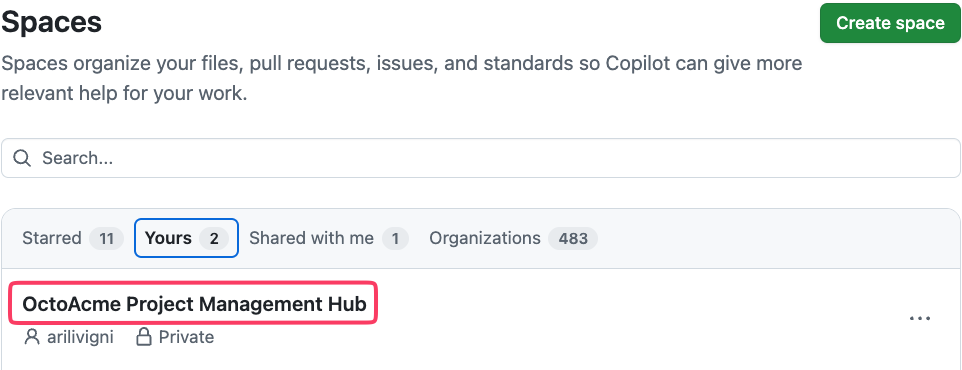

1. Add your files from the repository to the conversation by clicking on 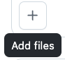 and selecting the option to add **Files**:

   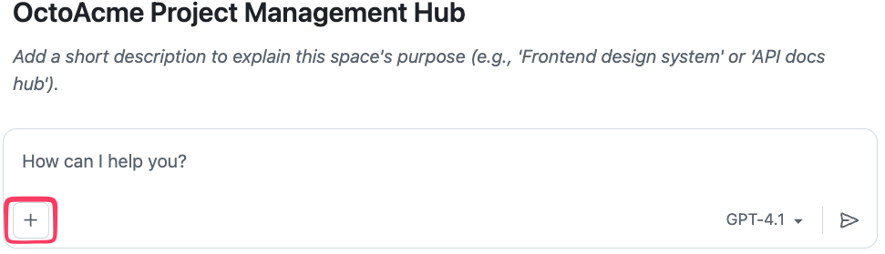
   

1. Select your repository or copy and paste the repository name in the search bar to find it:

   > ```text
   > {{full_repo_name}}
   > ```

   

1. Select the issue template to this new Copilot Space conversation.

   `.github/ISSUE_TEMPLATE/add-update-content-to-process-docs.yml`

     

1. Start a new conversation in the Copilot Space and use the following prompt to create an issue that identifies gaps in the project management processes documentation related to personas/roles and outlines needed improvements. Make sure to reference the attached issue template in your prompt.

   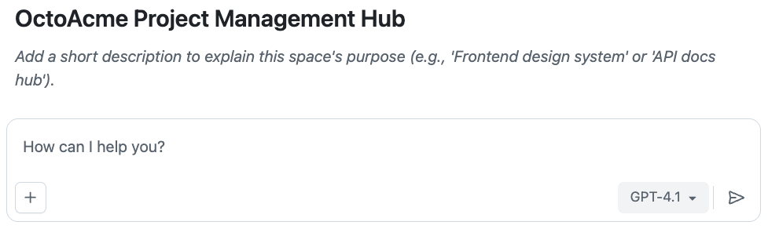

  > 
  >
  > ```prompt
  > Use the attached issue template
  > - Identify potential new personas/roles that could be added to the project management processes documentation
  >   to enhance clarity and accountability.
  > - Create an issue titled "Adding more personas and roles to the project management processes"
  >    that outlines the need to expand the defined roles and responsibilities in the project management documentation.
  > - Make sure the new roles/personas have descriptions of their responsibilities and how they interact with existing roles.
  > - The issue should detail why this is important, potential personas to add, and how it will improve project outcomes.
  > - add to the process document `docs/octoacme-roles-and-personas.md`
  > ```

   <details>
   <summary> 📷 Show screenshot of the issue draft</summary>

   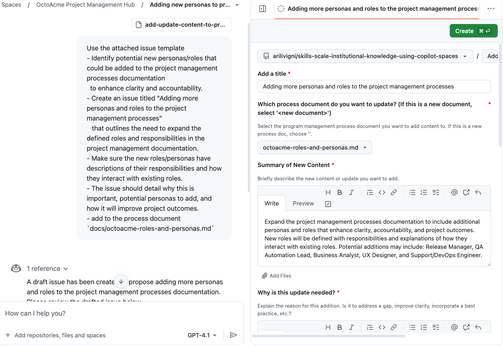

   </details>
   You can copy or open the link in a new tab to see the newly created issue

   <details>
   <summary> 📷 Show screenshot of the created issue</summary>

   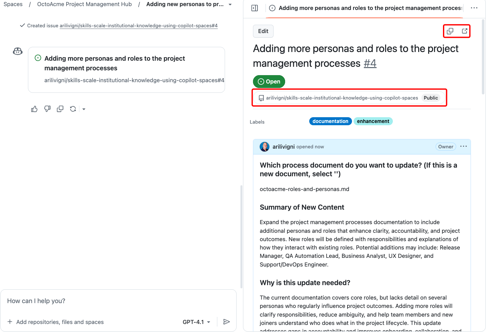

   </details>

### ⌨️ Activity: Attach an issue and create a Pull Request

_Use the following prompt in the current Copilot Space conversation:_

In the same Copilot Space conversation do the following:

1. In this activity we will attach the issue you created in the previous activity
2. This will assign the issue to the coding agent to create a pull request with an update to our personas/roles document in the `docs/` folder
3. Copy and paste the URL for the issue that we created in the previous activity.

> [!NOTE]
> Make sure the issue below matches the issue you want to attach
> Hit **\<SHIFT\> + \<ENTER\>** so you don't start Copilot working on the conversation

   In case the issue is not attached properly, you can also type the issue reference in the conversation:

   Check issues list: [https://github.com/{{full_repo_name}}/issues](https://github.com/{{full_repo_name}}/issues)

   ```text
   @{{full_repo_name}}/issues/#
   ```

   (Example: if your issue is #4, type `@{{full_repo_name}}/issues/4`)

   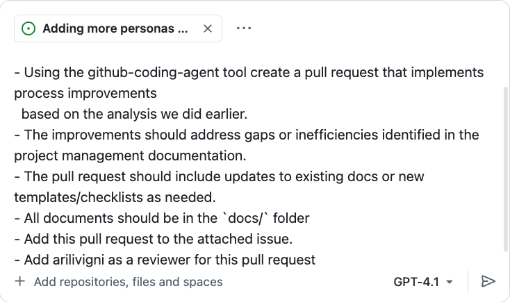

   > 
   >
   > ```prompt
   > - Using the github-coding-agent tool create a pull request that implements process improvements
   >   based on the analysis we did earlier.
   > - The improvements should address gaps or inefficiencies identified in the project management documentation.
   > - The pull request should include updates to existing docs or new templates/checklists as needed.
   > - All documents should be in the `docs/` folder
   > - Add this pull request to the attached issue.
   > - Add {{login}} as a reviewer for this pull request
   > ```

4. **Allow the coding agent**: When prompted, select **Allow** to let the coding agent work on your repository

   

5. **Monitor progress**: You should receive a notification that the Copilot coding agent is working on your pull request.

   There are two ways you can check the status of the coding agent working on your pull request

   #### Option 1: Check Pull Requests in your repository

   Go to your repository and click **Pull requests** and select the pull request to see the progress:

      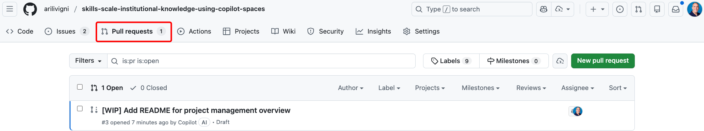

   #### Option 2: Check Agent Sessions in your Copilot Space on the left side under Agent sessions

   You can track the progress of the Copilot coding agent and view details on the left side under **Agent sessions**. Click on the session to see details about the tasks being performed by the agent.

      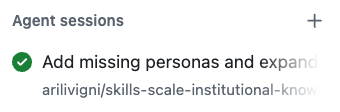

   You can get to the pull request that the agent is working on by clicking the link in the session details at the bottom where it says **View pull request**.

      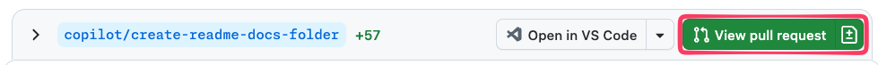

6. **Check open pull requests**: We can check pull request status from our **Copilot Space** as well.

   > 
   >
   > ```prompt
   > check open pull requests
   > ```

   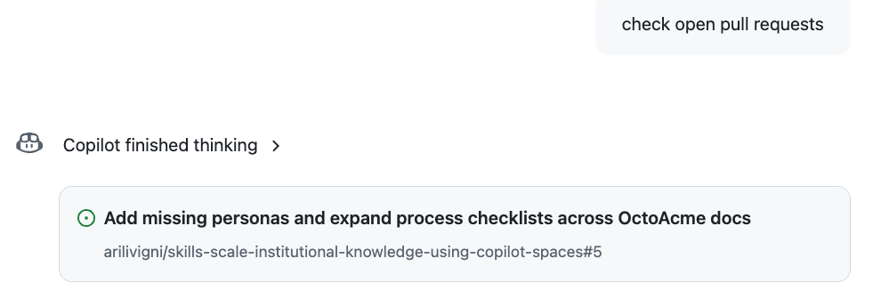

> [!NOTE]
> The coding agent typically takes 5-15 minutes to complete the work. If you want to track the work that the Copilot coding agent is doing from within the pull request, click **View session** 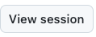 to watch the progress if desired.

7. **Review and merge**: Once the pull request is ready:

   a. **Submit review**: Leave a comment (optional), click **Approve**, then **Submit review**

      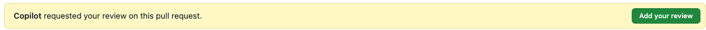

      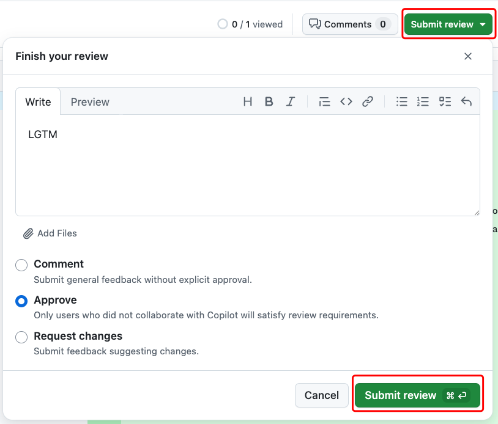

   b. **Merge**: Select **Ready for review**, then **Merge pull request** and **Confirm merge**

      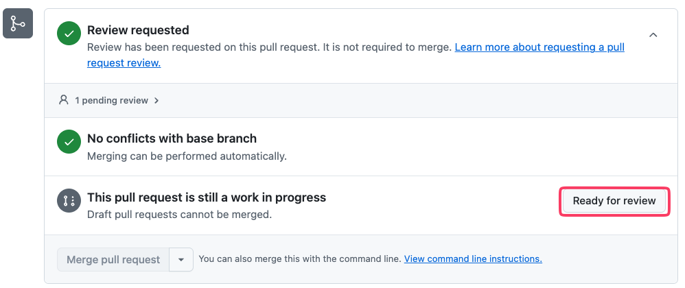
      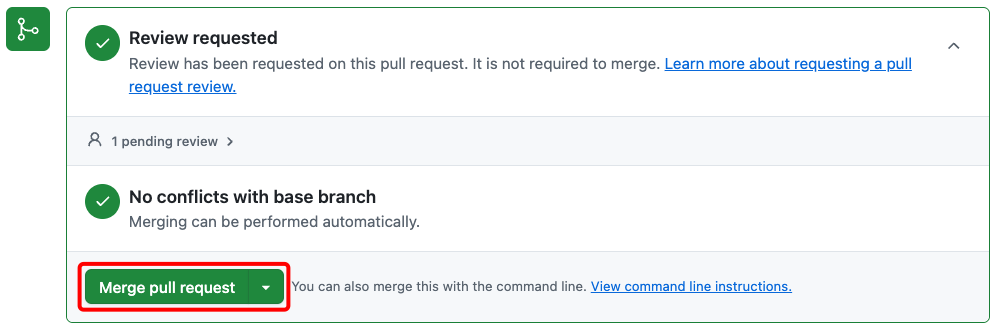

<details>
<summary>Having trouble? 🤷</summary>

- Focus on the most impactful improvements identified in your analysis
- Consider adding templates, checklists, or clarifying existing processes
- Common improvements include: role clarification, communication protocols, decision-making frameworks
- Even small improvements like adding examples or clarifying steps can be valuable

</details>
